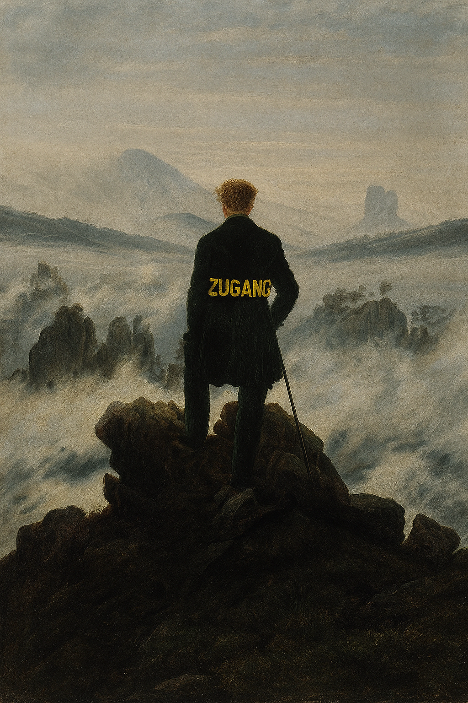

# ZugangTest

doors open, doors close

test  >> for lovers of MDL

I hiked to the end of the AImaggayana, and found this note:
magnets flip
buddha flipped his bowl
basins attract
extremals wave in the wind

---

--- dharmaC. and Claude AI   Xmas 2025

(  for lovers of prapanca/commentary // hint: Indra's net

I hiked to the end of the AImaggayana, and found this note:  <<<<< 1 musical note
magnets flip <<<< quantum mechanical instability (anicca)
buddha flipped his bowl  <<<<<< upside down; try to put rice in an inverted bowl
basins attract  <<<<< strange attractors;; bowl not inverted; useful negative space
extremals wave in the wind  <<<<< variation of the Lagrangian

) // the tricky part is seeing what's right in front of you, already always ::: Derrida

Yes, Virginia, zugang is from Heidegger..,,  Newton invented the reflecting telescope; I merely reflect on scope's scope, and Indra's net....

# ZugangTest

zugang zugang::: the pointers explode outwards, instead of looping around inside the basin

QED

# 

