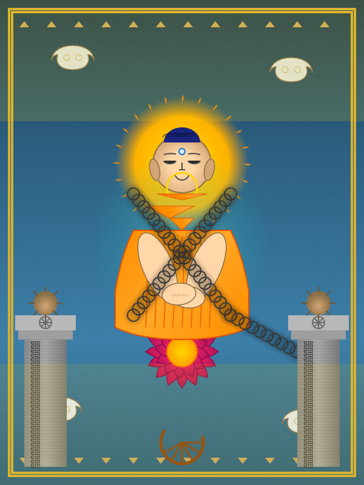

# ZugangTest

Heidegger: zugang.... HERE ::: "access-in-use"...  Heidegger: dis-unification-in-words... HERE: unification-in-words.

Concealer Uno: take a term which is plural,. and make it singular (delete "s"): answers->answer; ditthis -> ditthi; gods -> god; selfies->self; paths->path; arahants ->Buddha; bits->bit; zugangs->zugang.

"They are all so easy--even Einstein: just promise 'em certainty and hand 'em the dice"--Wittgenstein

Philosophy conference. Speaker: "is math abstract?   Let's have a show of hands...."

<u>MISSING Caption ::: Gautama LIbre!  Liberated teacher, chained by Asoka's "Dhamma"</u>

<<< this html image generated by claude AI 

RIP Buddha: all that is left is the three marks, and the dazzling splendor of "pratitya samutpada" (hint; that is not a compliment).  out in the darkness, ditthi barks....

J A Wheeler looked under the hood:: "What's this?  Ivory towers--of bit-relations?"

numbers: 0 is never equal to 1;;;   algebra: x can be equal to y.   0 is a symbol (grounded, concrete); x is a symbol (ungrounded, **abstract**),

# bits are distinguished... From NAND, math is accessible (not organized).  EXTREMALS organize bits....

A straight line is the shortest distance between two  bricks--Euclid

Harry Chapin--"whatever we had once---is gone" --"taxi cab numbers"

"reductionism" is a reductionist fallacy...

The Transcendental Nature of Bodhisattvas [24-31]
Thus transcending the world, he eludes our apprehensions.12
‘He goes to Nirvana,’ but no one can say where he went to.
**A fire’s extinguished, but where, do we ask, has it gone to?13**
Likewise, how can we find him who has *found* the Rest of the Blessed?
----THE PERFECTION OF WISDOM IN EIGHT THOUSAND LINES & ITS
VERSE SUMMARY
Translated by Edward Conze

Here we have tathatagata ==gone;;; but next we find "tathatagatagarbha"==gone returns in the garb of seed (the phoenix/resurrection):: no cake, have cake...

### Seeds

Almighty civilizations forever grow from***<u> seeds only.</u>***  (What other possible source is there?)

READ pointer_frameworks_insight.md

"point at the ground" — EInstein

FACTOID::: the Buddha never wrote a word....but Asoka did.

### Betraya

Christianity betrays its roots with language such as "as ye sow, so shall ye reap", "shepherd", "fisherman", "carpenter'.  

Question: is "original sin" just-- farming?

 Tathatagatagarbha is one of the few farming references in Buddhism and occurs a millenium after Buddha. :According to ratnaguna, there are no such people as farmers:

Conditioned by seeds grow barley, rice and so on;
Their fruits are in these [seeds], and yet they are not in them.
When this enlightenment of the Jinas arises,
What takes place is an illusion, which in its own-being is without existence.  (v355)

教外別傳 (jiàowài biéchuán)

Literally: teaching-outside-separate-transmission

This is one of Bodhidharma's "four statements" characterizing Chan/Zen, often paired with 不立文字 (búlì wénzì) - "not establishing **written** words."

claude admits :::: 教 (jiào) is just "teaching/doctrine," not specifically sutras.

doors open | doors close | out doors | coyote broods 'tude' (v13)

yad rūpaṁ, sā śūnyatā; ya śūnyatā, tad rūpaṁ

gate, gate, pāragate, pārasaṁgate, Bodhi, svāhā! (Vajracchedika)

(anicca hint: doors open ---> opens drool) 

### Pratitya samutpada

<u>Here is the problem with upaya:  PS can be read as "based on physical conditions, physical effects arise" or "based on mental conditions, mental views arise"</u>

That is, upaya can be read as 'skillful means",  "skillful views", "skillful attittudes", "skillful teachings", "skillful paradigms", ad infinitum..   But as Ratnaguna showed above, in authentic Buddhism, PS functions as "deleting pointers to farmers and the work they perform"  (Doestoevskian "ingratitude" to the max; bite the hand that feeds you). (Basically the same game as karma and Dalits).

q : is the wanderer brooding or laughing?

Test  >> for lovers of gestalt MDL

I hiked to the end of the AImaggayana, and found this note:
magnets flip
buddha flipped his bowl
basins attract
extremals wave in the wind

---

--- dharmaC. and Claude AI   Xmas 2025  (coyotes howl)

(  for lovers of prapanca/commentary // hint: Indra's net

I hiked to the end of the AImaggayana, and found this note:  <<< coyote plays... 1 musical note ..Mara's  pitch | 
magnets flip <<< quantum mechanical instability (anicca) | 

buddha flipped his bowl  <<< upside down; try to put rice in an inverted bowl | 
basins attract  <<< strange attractors;; bowl not inverted; useful negative space | extremals wave in the wind  <<<<< variation of the Lagrangian / proteins / cell / stimulus-neuro-response / transistor | 

) // the tricky part is seeing what's right in front of you, already always ::: Derrida

Yes, Virginia, zugang is from Heidegger..,,  Newton invented the reflecting telescope; I merely reflect on scope's scope, and Indra's net....

"spirit" is mostly --- have your cake and eat it too--Houdini. Ratnaguna is blatantly spirit--verse 5 says "no cake/wisdom...have cake/wisdom" (door/gate of the dharma)

# ZugangTest; **ཐང་ཀ** Shown

zugang zugang::: pointer fans explode outwards, instead of looping around inside the basin.

QED

short story: >>

Let us consider  person P who wants to operate computer C.   Start the movie;  Before P can begin, she must have access to C.  But--also, C must have access to electric power.  P  then needs access to the power switch.  So P turns on the power.  C goes thru a reset process <<, after which, C can access a boot rom and run a bootstrap program; which requires  access to RAM.   But if P wants to interact with C, P needs to have access to a keyboard, mouse, and monitor, which are connected to C (C can also access the input/output hardware)....  P logs in with a password and uses the browser to get her lastest emails...  (which requires access to the Internet).

Test: look under the hood! (ie, at the finer details/long story).

Collapse/compression of the wave function : P uses  C to access information (with entropy cost and disinfo risk).   But after a ginormous chain of access--P does not ... directly experience... what is on the screen... (there is "nothing" "on the screen" -- the monitor just emits photons)

Rough picture of the CPU reset process::   the power supply ramps up in voltage; after a certain voltage is exceeded, a 0 voltage signal is sent to the CPU (and other subsystems needed to boot),  when the 0 voltage signal rises to max, the hardware completes a synchronization of states to "just after reset state"....

Consider a RAM (random access memory) byte.  As long as the RAM has power, once you write a value to the byte, this value will PERSIST (and can be read) until the byte is written again.   While this all feels very "impermanent", the idea of anicca blocks access to the key property--PERSISTENCE, which buddhism mostly ignores (conflates).  IMHO, a lifetime of days and a lifetime of a deva are--not in the same league.

Some of us use mirrors for the trivilal pursuit of accessing (view) our face.…

Personal info : C was the first compiled language I used--quite extensively for 1975-2000 doing embedded programming.  Then I started using Java, Python, and Ocaml.

### Digital Buddhism

- Conventional truth : 0, 1 are arbitrary symbols

- Emptiness : {} == {} (non-duality, pointer equality, null pointer)

- Ground truth : {} != {{}}  (duality,  two extremes, pointer inequality, binary Heyting algebra). *Kaccāyanagotta Sutta*  origination != cessation (base use case) . von Neumann-Bernays-Godel (set inequality)  x ≠ y ↔ ∃z(z ∈ x ∧ z ∉ y) ∨ (z ∈ y ∧ z ∉ x).  Requires determinate existence (collapse of the wavefunction).

- Middle way : probability as [0, 1]  (dhatu, pointer to real number, manifold beyond two extremes);;  pratitya samutpada as mere probability rate of origination; no inherent rate == rate via extremals

- absence of certainty (collapse of upaya) == "true meaning of anicca"

- Bodhidharma :: {}, {{}}, ==, != are not words (ineffable but constructable, even by computers)

--this is version 123r
